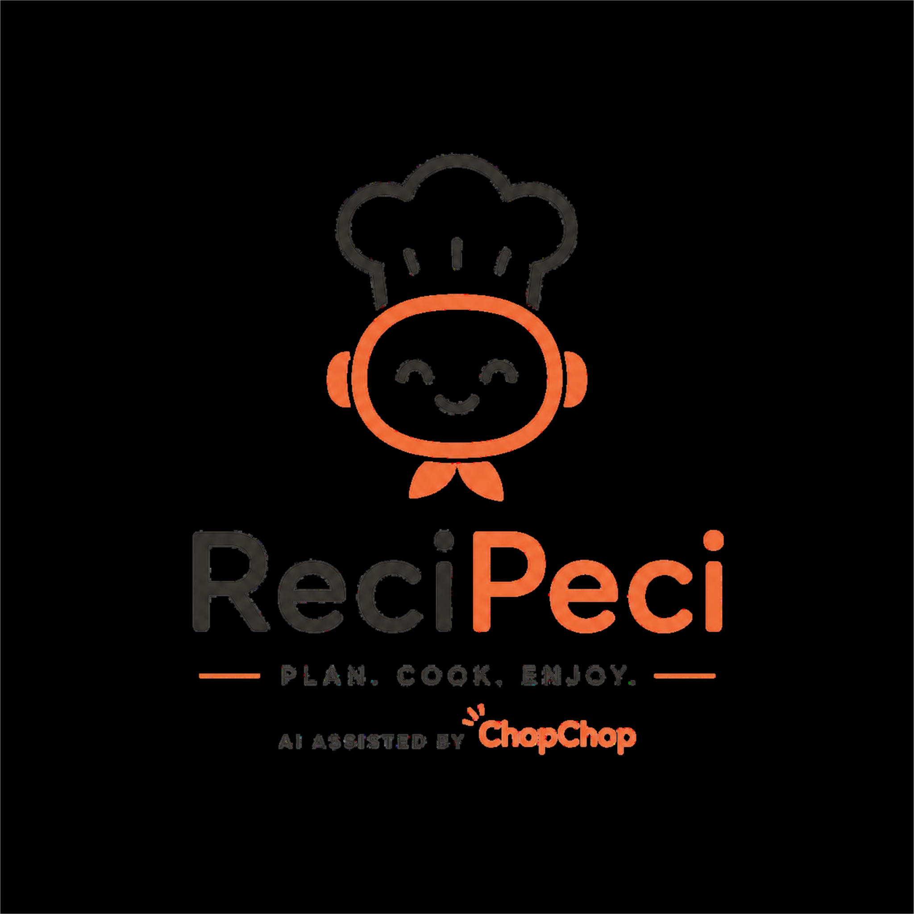

# ReciPeci

  

ReciPeci is a production-style hackathon MVP for AI-powered meal planning and cooking workflows.

ChopChop is the in-app assistant that helps users plan meals, review groceries, and follow a cooking workflow.

## Project Overview

- Monorepo with separate `frontend` and `backend` applications
- FastAPI backend serving API routes and the built frontend static files
- React + Vite + TypeScript + Tailwind frontend
- Single-container deployment target for Google Cloud Run
- No database and no authentication for the MVP

## Architecture

### Backend

- `api/` for versioned route modules
- `services/` for business logic boundaries
- `schemas/` for Pydantic request and response models
- `core/` for centralized configuration and app wiring
- `middleware/` for request lifecycle and security-related hooks
- `utils/` for shared helpers
- `tests/` for pytest scaffolding

### Frontend

- `components/` for reusable UI elements
- `pages/` for route-level screens
- `layouts/` for page shells and composition
- `hooks/` for shared React hooks
- `services/` for API client utilities
- `types/` for TypeScript contracts
- `utils/` for shared helpers

## Setup

1. Copy `.env.example` to `.env`
2. Install backend dependencies
3. Install frontend dependencies
4. Run backend and frontend in development mode

This scaffold intentionally keeps implementation lightweight so business logic can be added incrementally.

## Deployment Notes

- Intended for a single Google Cloud Run service
- Backend serves the compiled frontend assets
- Secrets must be provided through runtime environment variables
- No sensitive values should be bundled into frontend code
- The production container is built from the repository frontend bundle and then served through FastAPI
- Gemini runs only from the backend using `GEMINI_API_KEY`

## Gemini Integration

- ReciPeci uses `gemini-2.5-flash` for structured meal planning orchestration
- The Gemini layer lives behind the backend service boundary in `backend/services/gemini_service.py`
- Meal planning orchestration and fallback behavior live in `backend/services/meal_planner_service.py`
- Gemini is prompted to return strict JSON only so the frontend can keep the existing flow unchanged
- All Gemini responses are validated with Pydantic before they reach the API response
- If Gemini fails or returns malformed JSON, the backend falls back to a safe deterministic meal plan

## Environment

Required backend environment variables:

- `GEMINI_API_KEY`
- `GEMINI_MODEL` defaults to `gemini-2.5-flash`

## Validation and UX

- Frontend validates budget, dietary preference, cooking time, and people count before submit
- API responses are structured and typed
- Errors are surfaced with friendly copy instead of raw backend messages
- Kanban progression is keyboard friendly through standard button interactions

## Accessibility Considerations

- Use semantic HTML
- Support keyboard navigation
- Add descriptive labels and `aria-*` attributes where needed
- Ensure responsive layouts across screen sizes
- Maintain visible focus states and readable contrast

## Security Considerations

- Centralized environment validation
- No hardcoded secrets
- Gemini API calls stay on the backend only
- Input validation through Pydantic schemas
- Malformed Gemini payloads are parsed defensively and never forwarded directly to the client
- Request handling separated from service logic
- Prepared for future auth and persistence layers without coupling them into the MVP

## Testing

- Backend endpoint coverage through `pytest`
- Schema validation coverage for request models
- Gemini parsing, malformed payload handling, and fallback behavior coverage
- Frontend utility tests for validation and workflow progression
- Minimal test surface to keep the hackathon build fast and maintainable

## Scalability Roadmap

- Add persistence layer and repositories
- Introduce background job processing for heavier AI workflows
- Add authentication and user sessions
- Expand service boundaries for meal planning, pantry, and recipe history
- Add observability, tracing, and structured audit logging
